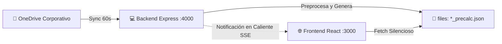

# 📡 Arquitectura de Monitoreo y Flujo de Datos SCADA (Fase: Monitoreo)

Este documento describe con un nivel minucioso de detalle técnico cómo funciona la **Fase de Monitoreo**, cómo se conecta con el backend, de dónde obtiene los datos en tiempo real y cómo los mantiene actualizados.

---

## 🗺️ 1. Flujo de Datos General

La aplicación utiliza un flujo híbrido optimizado para maximizar el rendimiento. Los datos fluyen de la siguiente manera:



1. **OneDrive Corporativo:** La fuente primaria de la verdad son los archivos Excel de la empresa (`DATAS DE DISEÑO.xlsx` y `PRUEBAS DE PRODUCCION.xlsx`).
2. **Backend local (Express):** Lee periódicamente estos archivos desde el OneDrive sincronizado localmente en la máquina.
3. **Preprocesador de Datos (`preprocesar_datos.js`):** Transforma las hojas pesadas de Excel en archivos estáticos optimizados mucho más ligeros (`designs_precalc.json` y `scada_precalc.json`).
4. **Frontend (React - PhaseMonitoreo):** Consume estos archivos JSON directamente para no sobrecargar el navegador de los ingenieros.

---

## 🔌 2. Conexión en Tiempo Real (SSE: Server-Sent Events)

El frontend mantiene una comunicación viva con el backend a través de **SSE (Server-Sent Events)**. 

### ¿Cómo funciona la conexión?
En el componente `PhaseMonitoreo.tsx` (Línea 362), se monta un efecto (`useEffect`) al iniciar el panel de control:
```typescript
eventSource = new EventSource('http://localhost:4000/api/data/live-updates');
```
A diferencia de WebSockets (que es de doble vía), SSE es un protocolo de **una sola vía** (del servidor al cliente) basado en HTTP tradicional. Es ultra ligero y consume muy pocos recursos de red.

### ¿Qué hace al recibir un evento?
Cuando el backend detecta cambios en la carpeta de OneDrive (utilizando un observador de archivos):
1. Envía un mensaje por el canal de eventos: `{ type: "update" }`.
2. El frontend recibe el evento `onmessage` (Línea 371) y ejecuta `reloadRef.current()`.
3. `reloadRef.current` realiza una **descarga silenciosa (Silent Reload)** de los archivos JSON actualizados sin interrumpir el trabajo del ingeniero ni congelar la pantalla.

---

## ⏱️ 3. Frecuencia de Refresco y Tiempos de Espera

*   **Sincronización Silenciosa:** Ocurre instantáneamente cada vez que el backend emite un cambio detectado.
*   **Reconexión en fallo (Retry-Delay):** Si la conexión con el backend Express se interrumpe (por ejemplo, al reiniciar los servidores), el cliente de SSE tiene una función de tolerancia a fallos:
    ```typescript
    eventSource.onerror = (err) => {
        eventSource?.close();
        setTimeout(connectSSE, 5000); // Reintenta conectar cada 5 segundos
    };
    ```
*   **Renderizado diferido (Filtros y Búsqueda):** Para evitar congelar la interfaz al procesar listas grandes de pozos, el campo de búsqueda utiliza `useDeferredValue` (React 19). Esto permite que el tecleado del usuario sea fluido, posponiendo el filtrado pesado por milisegundos de forma transparente.

---

## ⚙️ 4. Procesamiento Interno del SCADA y Diseños

Cuando se cargan los datos (ya sea por autodetectar archivos precalculados o porque el usuario subió un Excel manualmente), se ejecuta el proceso estructurado por `usePhaseMonitoreoImport.ts`:

### A. Procesamiento de Diseños (`processExcelDesignsBuffer`):
*   Extrae las dimensiones geométricas del pozo y de la bomba.
*   Mapea los catálogos internos de tuberías y revestidores (`casing` y `tubing`) en base a diámetros óptimos.
*   Determina los **Puntos de Run** leyendo el nombre único del pozo (Ej. `AVISPA #3` indica que es el Run número 3 de dicho pozo).

### B. Procesamiento de Telemetría SCADA (`processScadaBuffer`):
*   **Buscador Inteligente de Encabezados:** Escanea dinámicamente las primeras 40 filas del Excel buscando columnas clave como `POZO`, `FECHA`, `BFPD`.
*   **Mapeo de Encabezados Dobles (Dual Headers):** Si el Excel combina celdas (ej. la fila superior dice `THP` y la inferior `psi`), el parser crea una llave unificada `THP_PSI`. Esto evita duplicidad y mapea con exactitud los datos de telemetría de presión, corriente, voltaje y eficiencia de la bomba.
*   **PIP Persistente (Presión de Entrada de la Bomba):** Si un registro diario del SCADA carece de dato de presión (`PIP`), el motor utiliza una técnica de persistencia temporal: arrastra el último valor válido registrado para ese pozo para garantizar que los cálculos hidráulicos y de IPR sigan funcionando sin cortes.
