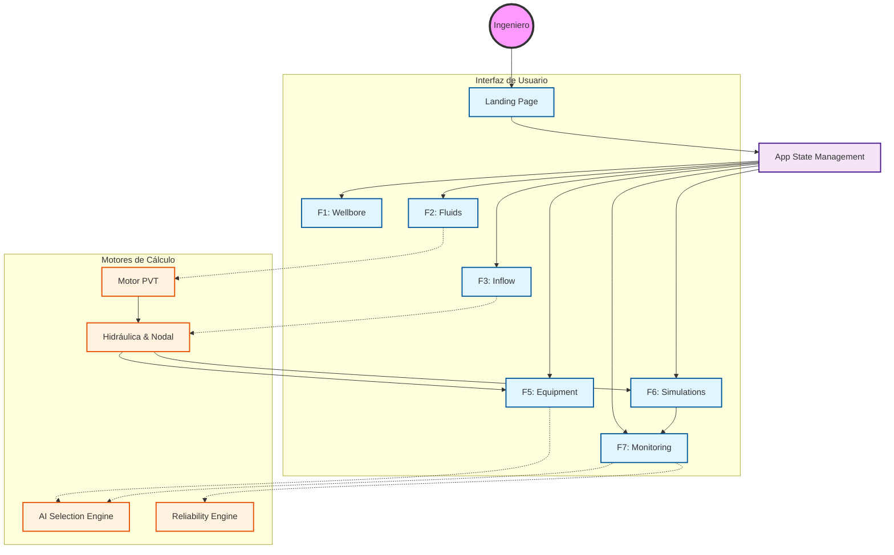

# 🛢️ ESP DESIGN STUDIO 🚀
### *Advanced Artificial Lift Engineering Suite*

---

**ESP DESIGN STUDIO** es una suite de ingeniería de vanguardia, diseñada para la conceptualización, simulación y optimización de sistemas de Bombeo Electrosumergible (ESP). Unifica el diseño mecánico, modelado PVT y análisis nodal en un ecosistema dinámico de alto rendimiento.

[Explorar Fases](#-3-detalle-operativo-por-fases) • [Modelos Matemáticos](#-5-modelos-matemáticos-y-fórmulas) • [Guía de Inicio](#-6-guía-de-uso-paso-a-paso)

---

## 💎 1. Introducción y Visión General

### 🎯 Propósito de la Aplicación
La plataforma permite a los ingenieros realizar un diseño integral de terminaciones de pozos, modelado de fluidos PVT riguroso y dimensionamiento electromecánico preciso, garantizando la máxima eficiencia operativa y vida útil del equipo.

### 👥 Público Objetivo
*   **👷 Ingenieros de Producción:** Diagnóstico de pozos y optimización de curvas IPR/VLP.
*   **🔌 Especialistas ESP:** Selección precisa de bombas, motores y variadores (VSD).
*   **📊 Gerencia de Activos:** Análisis de rentabilidad y proyecciones OPEX/CAPEX.

### ⚡ Capacidades Core
> [!IMPORTANT]
> **Ecosistema Integrado:** Toda la lógica de cálculo reside en el cliente (Frontend), lo que permite simulaciones instantáneas sin latencia de red.

- **Modelado PVT:** Correlaciones industriales (Lasater, Vasquez-Beggs, etc.).
- **Análisis Nodal AI:** Curvas dinámicas con corrección automática de GOR.
- **Smart Matching:** Algoritmos de selección asistida para equipos ESP.
- **Simulación de Desgaste:** Modelos predictivos de vida útil.

---

## 🏗️ 2. Arquitectura del Sistema

La aplicación utiliza un stack moderno basado en **React + TypeScript**, optimizado para cálculos determinísticos pesados.

### 🗺️ Mapa Conceptual y Flujo de Datos

---

## 🔄 3. Detalle Operativo por Fases

### 📍 Fase 1: Wellbore (Arquitectura)
*   **Geometría:** Captura de Casing, Tubing y profundidades (MD/TVD).
*   **Inteligencia:** Interpolación automática de survey direccional para cálculo hidrostático.

### 🧪 Fase 2: Fluids (Termodinámica)
*   **Cálculo PVT:** Factores de volumen ($B_o, B_w, B_g$), viscosidad y tensión superficial.
*   **Alertas:** Detección automática de inconsistencias entre GOR y Presión de Burbuja ($P_b$).

### 📈 Fase 3: Inflow (Productividad)
*   **Modelado:** Soporte para Darcy (Lineal) y Vogel (Multifásico).
*   **AOF:** Cálculo automático del Caudal Absoluto (Absolute Open Flow).

### ⚙️ Fase 5: Equipment (Selección)
*   **Matching:** Cruce de curva de bomba vs. curva de sistema.
*   **Electromecánica:** Cálculo de BHP, etapas, leyes de afinidad y caídas de voltaje en cable.

### 📡 Fase 7: Monitoring (Confiabilidad)
*   **Gestión de Flotas:** Visualización masiva de pozos y semaforización de salud (Health Scoring).
*   **Predictivo:** Motor de diagnóstico de empujes (Upthrust/Downthrust) y degradación de bomba.
*   **Integración:** Importación masiva de datos SCADA y pruebas de producción vía Excel.

---

## 📦 4. Análisis de Componentes

| Módulo | Función Técnica | Impacto en Diseño |
| :--- | :--- | :--- |
| `PhaseMonitoreo.tsx` | Orquestador de Flota | Centralización de monitoreo y análisis masivo. |
| `useAnalysisEngine.ts` | Motor de Diagnóstico | Cálculos de degradación y eficiencia en tiempo real. |
| `FloatingAiPanel.tsx` | Co-Piloto de IA | Asistente experto basado en Gemini 1.5 Flash. |
| `VisualESPStack.tsx` | Renderizado 2D/3D | Visualización mecánica y estado de salud por componente. |
| `PumpChart.tsx` | Gráficos Dinámicos | Intersección de curvas en tiempo real. |
| `AiMemoryService.ts` | Memoria Técnica | Almacenamiento y exportación de casos de éxito y fallas. |

---

## 🧪 5. Modelos Matemáticos y Fórmulas

<b>📖 Ver Detalles de Ecuaciones</b>

### A. IPR Multifásico (Vogel)
$$ \frac{q}{q_{max}} = 1 - 0.2 \left( \frac{P_{wf}}{P_r} \right) - 0.8 \left( \frac{P_{wf}}{P_r} \right)^2 $$

### B. Gas en Solución (Lasater)
$$ y_g = \frac{ \gamma_g \cdot P }{ \gamma_g \cdot P + \frac{352.4 \cdot T}{M_o} } $$

### C. Fricción (Colebrook-White)
$$ \frac{1}{\sqrt{f}} = -1.8 \log_{10} \left[ \left( \frac{\epsilon / D}{3.7} \right)^{1.11} + \frac{6.9}{Re} \right] $$

---

## 🤖 6. Antigravity AI Co-Pilot
El sistema integra una capa de Inteligencia Artificial avanzada diseñada para actuar como un ingeniero experto de guardia.

- **Memoria Técnica Dinámica:** El sistema aprende de las interacciones y guarda firmas técnicas de fallas para futuras referencias.
- **Análisis Multi-Pozo:** Capacidad de analizar tendencias en toda la flota simultáneamente.
- **Exportación de Casos:** Los diagnósticos de la IA pueden exportarse como archivos JSON para auditorías de confiabilidad.

---

## 🛠️ 7. Guía de Uso Paso a Paso

1.  **🚀 Inicio:** Ejecuta `🛢️_INICIAR_ESP_STUDIO.bat`.
2.  **📝 Datos:** Completa las fases secuencialmente (1 → 6).
3.  **⚖️ Optimización:** Ajusta la frecuencia (Hz) en la Fase 5 para encontrar el punto de operación ideal.
4.  **📂 Reporte:** Genera y exporta el diseño final en formato Excel/PDF.

---

**ESP DESIGN STUDIO - Professional Edition 2026**  
*Ingeniería de Excelencia para el Sector Energético*

[Subir al Inicio ▲](#-esp-design-studio-)

